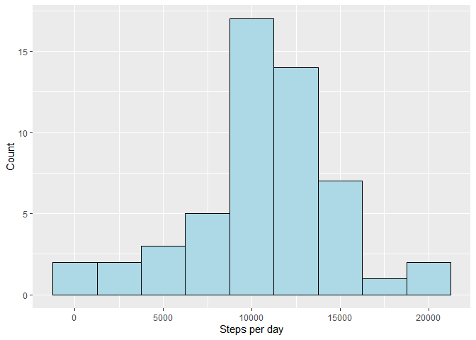
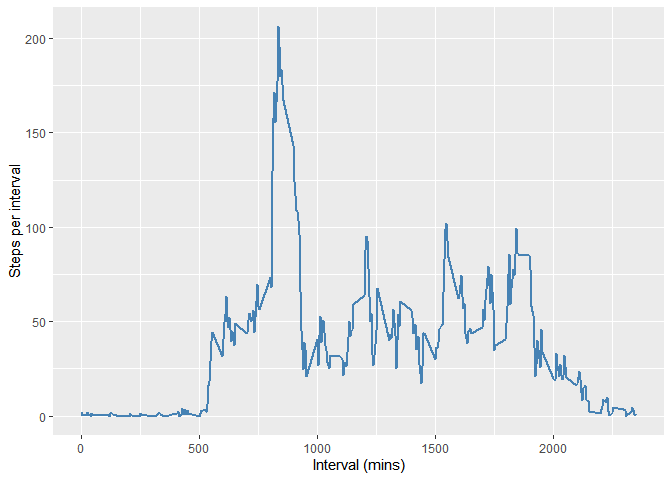
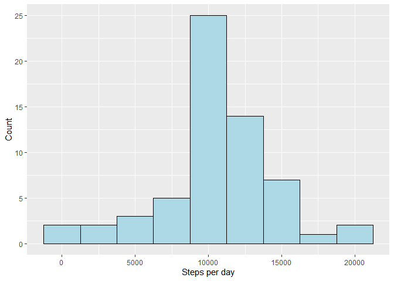
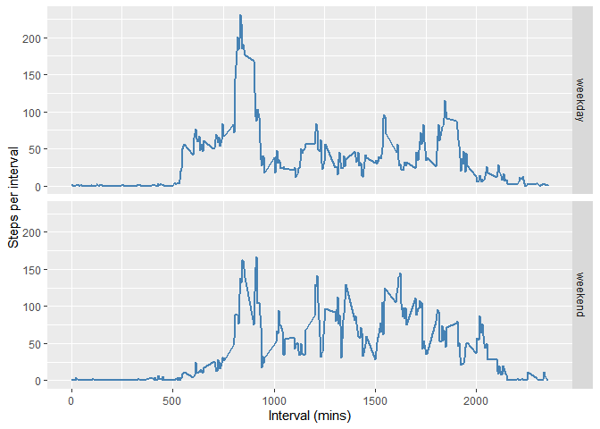

## Loading and preprocessing the data
First unzip the data, if not already done so, and load the data.  

```r
if (!file.exists("activity.csv")){
        unzip("activity.zip")
}
rawData <- read.csv("activity.csv", stringsAsFactors = F)
no_NA <- na.omit(rawData)
```
  
Load required libraries 

```r
library(dplyr);
```

```
## 
## Attaching package: 'dplyr'
```

```
## The following objects are masked from 'package:stats':
## 
##     filter, lag
```

```
## The following objects are masked from 'package:base':
## 
##     intersect, setdiff, setequal, union
```

```r
library(ggplot2);
```

## What is mean total number of steps taken per day?
1. Calculate the total number of steps taken per day.   

```r
dayTotals <- group_by(no_NA, date)
dayTotals <- summarise(dayTotals, steps = sum(steps))
```
  
2. Make a histogram of the total number of steps taken each day.   

```r
his <- ggplot(data = dayTotals, aes(steps))
his <- his + geom_histogram(binwidth = 2500, color = "black", fill = "lightblue")
his <- his + xlab("Steps per day") + ylab("Count")
print(his)
```

<!-- -->
  
3. Calculate and report the mean and median of the total number of steps taken per day.  

```r
mean_StepsPerDay <- mean(dayTotals$steps)
median_StepsPerDay <- median(dayTotals$steps)
```
  
The mean and median of the total number of steps taken per day are 1.0766189\times 10^{4} and 10765 respectively

## What is the average daily activity pattern?
1. Make a time series plot (i.e. type="l") of the 5-minute interval (x-axis) and the average number of steps taken, averaged across all days (y-axis).  

```r
intervalTotals <- group_by(no_NA, interval)
intervalTotals <- summarise(intervalTotals, steps = mean(steps))

line <- ggplot(data = intervalTotals, aes(x = interval, y = steps))
line <- line + geom_line(color="steelblue", size = 1)
line <- line + xlab("Interval (mins)") + ylab("Steps per interval")
print(line)
```

<!-- -->
2. Which 5-minute interval, on average across all the days in the dataset, contains the maximum number of steps?  

```r
maxAverageSteps <- max(intervalTotals$steps)
maxInterval <- filter(intervalTotals,intervalTotals$steps %in% maxAverageSteps)
maxInterval <- as.numeric(maxInterval[1,1])
```
The 5-minute unterval which contains the maximum number of steps is 835. 

## Imputing missing values
1. Calculate and report the total number of missing values in the dataset (i.e. the total number of rows with NAs)

```r
numberMissingValues <- nrow(data) - nrow(no_NA)
```
There are  missing values within the dataset. 

2. Devise a strategy for filling in all of the missing values in the dataset. The strategy does not need to be sophisticated. For example, you could use the mean/median for that day, or the mean for that 5-minute interval, etc.
  
For this work missing values will be replaced by the mean for that 5-minute interval.

3. Create a new dataset that is equal to the original dataset but with the missing data filled in.

```r
meanInterval <- function(n){
        a <- filter(intervalTotals, intervalTotals$interval %in% n)
        a$steps 
}

newData <- rawData
for (i in 1:nrow(newData)){
        if (is.na(newData[i,1])){
                newData[i,1] <- meanInterval(newData[i,3])
        }
}
```

4. Make a histogram of the total number of steps taken each day and calculate and report the mean and median total number of steps taken per day. Do these values differ from the estimates from the first part of the assignment? What is the impact of imputing missing data on the estimates of the total daily number of steps?
  
Code to make the histogram:

```r
newDayTotals <- group_by(newData, date)
newDayTotals <- summarise(newDayTotals, steps = sum(steps))

his <- ggplot(data = newDayTotals, aes(steps))
his <- his + geom_histogram(binwidth = 2500, color = "black", fill = "lightblue")
his <- his + xlab("Steps per day") + ylab("Count")
print(his)
```

<!-- -->
  
Code to calculate mean and median:

```r
newMean <- mean(newDayTotals$steps)
newMedian <- median(newDayTotals$steps)
```
The mean and median of the total number of steps taken per day, when missing values have been replaced by the average for that interval, are 1.0766189\times 10^{4} and 1.0766189\times 10^{4} respectively. 
  
The mean remain the same for both datasets. The median has decreased and is now the same value as the mean. By inputting the missing values the frequency of the average total daily number of steps has increased by 10, as reflected by the new histogram. 

## Are there differences in activity patterns between weekdays and weekends?

1. Create a new factor variable in the dataset with two levels – “weekday” and “weekend” indicating whether a given date is a weekday or weekend day.

```r
dayOfWeek <- weekdays(as.Date(newData$date))

for(i in 1:length(dayOfWeek)){
        if (dayOfWeek[i] == "Saturday" | dayOfWeek[i] == "Sunday"){
                dayOfWeek[i] <- "weekend"
        }
        else{
                dayOfWeek[i] <- "weekday"
        }
}

newData1 <- cbind(newData, dayOfWeek)
```
  
2. Make a panel plot containing a time series plot (i.e. type="l") of the 5-minute interval (x-axis) and the average number of steps taken, averaged across all weekday days or weekend days (y-axis). See the README file in the GitHub repository to see an example of what this plot should look like using simulated data. 
  
Code to find average steps for each interval for the weekend and weekdays. 

```r
IntervalAverage <- group_by(newData1, interval, dayOfWeek)
IntervalAverage <- summarise(IntervalAverage, steps = mean(steps))
```

Code to produce panel plots

```r
p <- ggplot(data = IntervalAverage, aes(x = interval, y = steps)) + facet_grid(rows=vars(dayOfWeek))
p <- p + geom_line(color="steelblue", size = 1)
p <- p + xlab("Interval (mins)") + ylab("Steps per interval")
print(p)
```

<!-- -->
